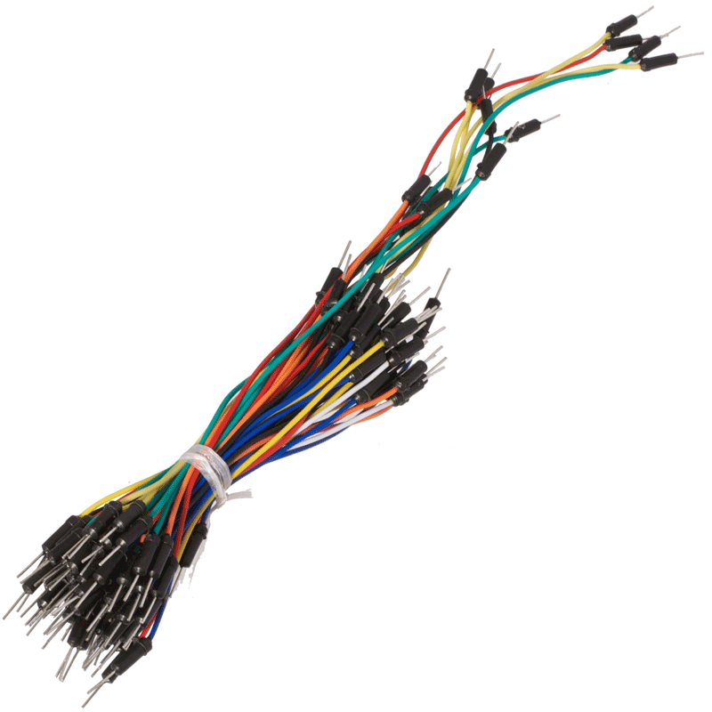

# Afspraken labo

* **Kom op tijd:**  
  Kom op tijd naar de labo's. Komt u te laat dan bent u geselecteerd als
  vrijwillger voor het opruimen van het labo (lees: Eindeloos componenten
  sorteren).

* **Vaste werkplek:**  
  Om orde in het labo te garanderen, krijgt u een vaste werkplek. U behoud deze
  werkplek gedurende het hele semester. Deze werkplek moet volledige opgeruimd
  worden na elke labo sessie.

* **Materiaal:**  
  Het enigste materiaal dat u moet voorzien zijn kabels. U heeft een `USB B
  naar USB Micro` en een `USB naar USB mini` nodig. Daarna heeft u breadboard
  kabeltjes nodig. Zorg voor een gezonde mix, neem 40 tal `M-M` kabels, 10
  `M-F` kabels en 10 `F-F` kabels. Je koopt deze best rechtstreeks uit China.
  Bestel ze tijdig. 

  Het overige materiaal word voorzien door de opleiding. Toon het nodige
  respect voor het materiaal. Blijf uit het labokasten.

* **Eten & Drinken:**  
  Er wordt niet gegeten tijdens/in het labo. Er mag gedronken worden in het
  labo indien het drankje in een afsluitbare container zit.

* **Werk in rust**:  
  Werk in alle rust en eigen tempo aan je labo's. Zorg dat je de andere niet
  stoort.

