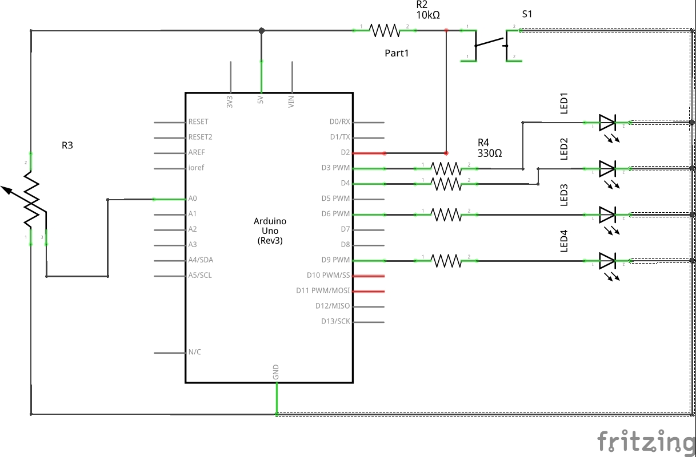

# Labo 1: Basis IO Operaties


## Opdracht 1: Installeer de Arduino IDE

Download op de Arduino IDE op de volgende website
[https://www.arduino.cc/en/Main/Software](https://www.arduino.cc/en/Main/Software)

Voor de labo's mag je ook de Visual Studio plugin of PlatformIO gebruiken. Dit
is wel op eigen verantwoordelijkheid. De labo's worden opgebouw aan de hand van
de Arduino IDE.

## Opdracht 2: Run blink

Om de installatie van de Arduino IDE te valideren ga je de het blinky voorbeeld
uploaden naar de Arduino. 

Je kan het blink example vinden bij `File > Examples > 01.Basics > Blink`. 
Dit opent een nieuwe instantie van de Arduino IDE. 

Om de code op het bordje te krijgen moet je eerst nog een Arduino bord
selecteren en de juiste COM poort selecteren. De COM poort selecteer je bij
`Tools > Port > COMX`. Op Linux of MacOS is dit meestal `/dev/ttyUSBX` of een
varatie. Het juiste Arduino bord selecteer je bij   `Tools > Board > BoardX`.

**De blink sketch heeft het volgend schema:**

*Dit schema moet je niet opbouwen, dit is al opgebouwd op de Arduino IDE*


**De blink sketch ziet er als het volgt uit:**

```arduino
void setup() {
  pinMode(LED_BUILTIN, OUTPUT);
}


void loop() {
  digitalWrite(LED_BUILTIN, HIGH);   // turn the LED on (HIGH is the voltage level)
  delay(1000);                       // wait for a second
  digitalWrite(LED_BUILTIN, LOW);    // turn the LED off by making the voltage LOW
  delay(1000);                       // wait for a second
}
```

De sketch opgedeeld in 2 delen. Eerst komt de setup en daarna de loop. De setup
functie loopt eenmaal wanneer de Arduino stroom krijgt of nadat het bordje
reset. De loop functie loopt oneindig. 

De pinMode, digitalWrite en delay functie worden voorzien door libraries van
Arduino hun exacte beschrijving kan je hier vinden:

* [pinMode](https://www.arduino.cc/en/Reference/PinMode)
* [digitalWrite](https://www.arduino.cc/en/Reference/DigitalWrite)
* [delay](https://www.arduino.cc/en/Reference/Delay)

### Uitbreiding

* Laat het ingebouwd ledje SOS blinken.
* Laat 4 ledjes met volgend patroon patroon branden:
  * Alle 4 aan.
  * Laat alle 4 sequentieel branden met telkens 2 seconden pauze.
  * 2 Ledjes aan, 2 ledjes, 1 seconden wachten, de andere 2 ledjes aan en de andere uit.


## Opdracht 3:

Laad het Fade example in op de Arduino Nano. Het is mogelijk om een pseudo
voltage waarde weg te schrijven naar een pin. Deze waarde kan gaan van 0V tot
5V. Verander de pin waarde naar de pin met het ingebouwde ledje. Noteer het
gedrag.

Lees volgend Arduino referentie document:
* [analogWrite](https://www.arduino.cc/en/Reference/DigitalRead)


## Opdracht 4: 

Lees volgende Arduino referentie documenten:
* [digitalRead](https://www.arduino.cc/en/Reference/DigitalRead)
* [analogRead](https://www.arduino.cc/en/Reference/DigitalRead)

Nu ben je klaar om je eerst Arduino programmatje te schrijven. Je moet een
programma schrijven met de volgende functionaliteit:

* De drukknop wordt gebruikt om door volgende modi te gaan:
  * Elke led apart te selecteren
  * Alle leds te selecteren
  * 5 modis totaal
* De potentiometer wordt gebruikt om de intensiteit van de led te regelen
* Elke led is individueel instelbaar
* Als alle leds geselecteerd zijn wordt de vorige waarde overschreden
* In de "alle leds" mode, wordt de waarde pas overschreven na dat de
  potentiometer van waarde veranderd.


Voor deze opdracht mag je volgend schema gebruiken: 


