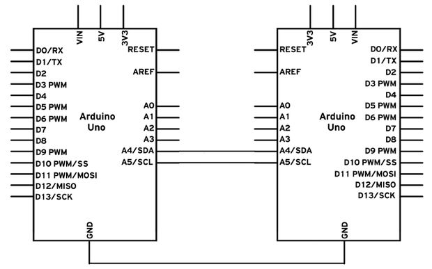

# Lab 2: Seriele Communicatie

Tijdens dit labo gaan de seriele communicatie mogelijkheden van de Arduino
verkennen. We gaan een led instellen via de seriele monitor, een zin omvormen
naar morse code en communicatie opzetten tussen 2 arduino's

## Oefening 1: Instellen intensiteit van een led

Schrijf een programma voor de Arduino waarmee je een ledje stuurt via PWM. De
waarde voor PWM, stuur je door via de seriele poort. Echo de waarde dat je
binnen krijgt terug op de seriele poort. 

* *Noot 1: Vergeet niet gebruik te maken van een pin waarop PWM beschikbaar  
           is.*

* *Noot 2: Als je bv 255 doorstuurt dan stuur je 3 ASCII karakters door. Deze
           karakters zet je om naar een integer*

## Oefening 2: Instellen intensiteit van meerdere leds

Voor de volgende oefening breiden we de vorige opdracht uit. We gaan het zelfde
doen maar voor 4 pinnen. Er is nog een extra vereiste. Je moet de 4 leds met
een commando instellen.

Je kan 2 volgende methodes gebruiken om een commando op te bouwen. 

1. Gebruik maken van een stopteken  
    Door na elke parameter van een commando een stop teken te zetten kan je
    verschillende commandos op een regel krijgen. Een stopteken is meestal een
    teken dat niet een cijfer of een letter is. Dit teken kan je dan opzoeken
    in je verwerking van het commando

    bv: `192.170.1.110`
2. Vaste lengte paramameters
    Door elke paramater van een commando een vaste lengte te hebben heb je een
    houvast voor het verwerken van je paramaters in een commando. Je bouw de
    vaste lengte ophet door gebruik te maken van vulkarakters.
    
    bv: `1023000401570033` De nul in het commando's zijn vulkarakters

## Oefening 3: Morse Generator

Je bouwt de arduino om naar een morse generator, dit doe je door het omzetten
van een zin die je invoert naar morse karakters. Deze morse karakters geef je
dan weer door behulp van een led.

Een vereiste voor dit labo is dat je gebruik maakt van een lookup tabel.

## Oefening 4: Communicatie tussen 2 Arduino's

Voor deze oefening moet je met 2 samenwerken. 

Je gaat communicatie opzetten tussen 2 Arduino's door gebruik te maken van i2c.
Dit is een serieel protocol dat met 2 draden een multi master configuratie
voorziet. Volgend schema geeft dit weer:

Om te starten met i2c lees je volgende tutorial:
[MasterReader](https://www.arduino.cc/en/Tutorial/MasterReader)

Nu gaan we deze mogelijkheid uitbreiden om een 2 player tik tak toe te maken. Meer info over het spelletje vind je [hier](https://en.wikipedia.org/wiki/Tic-tac-toe).

Wat moet het allemaal kunnen:

* Speelveld van 3x3, dit word na elke beurt afgedrukt op beide seriele monitors
* De input word gegeven via de seriele monitor
* (Optioneel) Het einde word automatisch gededecteerd worden 
* (Optioneel) Je kan het spelletje resetten met het commando `reset`

## Verslag:
* 4 individuele oefening files 

