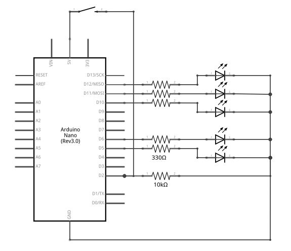

# Labo 3: Interrupts

## Beschrijving

In dit labo leren we interrupts gebruiken door het spelletje Whack-a-Mole na te
maken. Het doel van dit spel is het op het hoofd slagen van de mol. We gaan dit
simuleren m.b.v. leds en pushbuttons. Als opstelling gebruiken we een rij van
leds verbonden aan de Arduino. De leds gaan in een bepaald patroon branden. Een
led doet dienst als *mol led*. Wanneer de mol led brand en je drukt simultaan
op een knop dan scoor je een punt. Als je een punt scoort dan versnelt de
veranderingen in het ingestelde patroon. Druk je op het verkeerde moment op de
knop dan gaat reset de snelheid.

Wie haalt de hoogste snelheid?

## Schema

## Functionaliteit

* Laat de leds afwisselend branden
  * De leds branden sequentieel afzonderlijk.
  * De snelheid van de sequentie is aanpasbaar.
* Een button simuleert de hamer van Whack-a-Mole.
  * Als led #3 brand moet je met de *hamer slaan*
  * De button is interrupt gestuurd
* Er is een uitbreiding voor het spel waarin 2-player functionaliteit
  introduceren. De 2de speler bedient een knop die de volgende functionaliteit
  heeft.
  * Bij het indrukken van de knop veranderd de richting van de sequentie.
  * Je bouwt een non-blocking delay in op deze drukknop. 
  * Bij elke druk op deze knop verhoogt de ingebouwde delay.
  * De delay reset als speler mist bij *het slaan van de hamer*

## Verslag
* Individueel ino bestand

