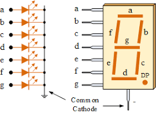
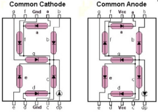
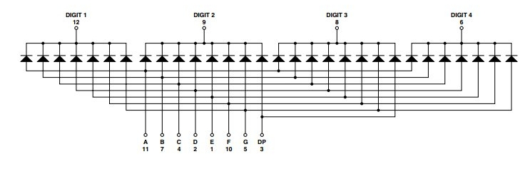
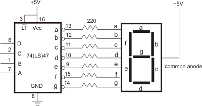

# Labo 4: Libraries  

Voor dit labo gaan we zelf een library ontwerpen. We doorlopen hiervoor de
typische stappen. Gebruikelijk is de éérste stap het doornemen van de
datasheet van de hardware waarvoor we onze bibliotheek willen bouwen. De
library die we gaan ontwerpen is voor een 4 digit 7 segment display. De
datasheet vind je hier: [Datasheet HDSP-B09G](img/datasheet7seg.pdf).
Om je wat opweg te helpen staat hieronder wat uitleg over dit type display's
alsook de belangrijkste tekening uit deze datasheet.

## Wat zijn 7 segment displays?

Een 7 segment display is eigenlijk niets meer dan meerdere LED's in één verpakking
Pas wél op want er zijn __twéé types__ namelijk:
- **common anode :**  
  De anodes van alle led's staan parallel
- **common cathode :** 
  De cathodes van alle led's staan parallel Kijk steeds de datasheets goed na,
  vaak is de component-code bijna identiek...  De displays in jullie componenten
  bakjes zijn 'common cathode' :__*Dit wil zeggen dat de weerstanden voor de
  LED's in serie met de anodes moeten komen*__ 

 Hierboven zie je het intern schema van het 'HDSP-B09G' 4 x 7 segment display (Pin 1 is links aan de kant van het opschrift)
 Deze HDSP-B09G is het display die in jou bakje met onderdelen zit.

## Opdrachten

### Oefening 1: Display tester
Om zeker te zijn dat je display werkt en dat je alles goed aangesloten hebt
maak je eerst een 'display tester' Je laat in logische volgorde één voor één
alle LED's van het hele display eens oplichten in twee geneste for loops.  Dus
eerst digit 1, LED a, b, c, d .. dan digit 2 LED a, b, c, d .. enzoverder Je
kiest de pinnen van de Arduino zodat je code zo eenvoudig mogelijk wordt...

Alle pinnen moeten outputs zijn! De LED's branden dan énkel als de pin aan de
anode 'HIGH' staat en die aan de cathode 'LOW'

### Oefening 2: one-digit-counter
Stuur één van 7-segment display digits aan en je laat deze tellen van 0 tot 9
door één op te hogen telkens een drukknop wordt ingedrukt.  Om deze digit aan
te sturen maak je gebruik van 'bcd-to-7segment decoding' Je isoleert hierbij de
code van deze bcd-to-7segment decoding zodat ze gemakkelijk herbruikbaar is

In de praktijk zal je voor deze bcd naar 7 segment decodering vaak een apparte
chip gebruiken zoals bvb. de 74LS47 hiernaast.

Dit levert een sterke reductie van het aantal nodige output pinnen en neemt
onnodige belasting weg doordat het nu de bcd-to-7seg chip is die de stroom
levert aan de LED's en niet de microcontroller.

Sommige chips hebben ook enkele bytes geheugen aan boord waardoor ze meerdere
digit's in een keer kunnen aansturen. Vaak zit er zelfs een pin op waarmee je
de licht-intensiteit van het display kan sturen.
 
De cpu wordt hierdoor sterk onlast en dus beschikbaar voor nuttiger taken.

*Deze chip zit echter niet in je bakje dus los je dit op met code!*

### Oefening 3: Creëren basisversie van de library
Als je de 'bcd-to-7segment' decoding goed isoleerde bij oefening2 dan kan je
deze code nu verplaatsen naar een library.  Meer uitleg over hoe je zo'n
library moet opbouwen vind je hier: [Library
Tutorial](href="https://www.arduino.cc/en/Hacking/LibraryTutorial) Om te
starten creëer je de library in dezelfde directory als waar je '.ino' file
staat.  Als dit goed werkt verplaats je deze naar de Arduino Library directory
Je voegt ook de nodige 'keywords.txt' file toe zodat de highlighting van jou
keywords werkt Je doet alles op basis van de vorige oefening zodat het
resultaat terug dezelfde teller is, alleen nu #include je jou library en
gebruik je jou eigen gedefinieerde keywords. 

### Oefening 4 : Chronometer
Bouw nu een chrono-meter, je deelt je code op in goed gekozen routines
(functies) om er voor te zorgen dat de crono-meter ook 'op tijd' loopt.  Een
microcontroler is minder krachtig dan een PC, dus de kost van je instructies
wordt heel belangrijk.

Bij een multi-digit 7segment display kan je niet alle LED's van alle digits
afzonderlijk aansturen.  Met de beschikbare pinnen kan je, zoals je kon zien op
de vorige tekeningen, eigenlijk maar één digit tegelijk aansturen.  Om toch
gegevens op alle 4 de digits te kunnen schrijven maak je daarom gebruik van
'scanning'

Bij scanning stuur je eerst de LED's van de éérste digit, dan de tweede, etc.
Als deze snel genoeg aangestuurd worden merkt ons oog er niets van.  Je zorgt
er voor dat jou library ook deze scanning op zich neemt en correct werkt met
meerdere digits.

