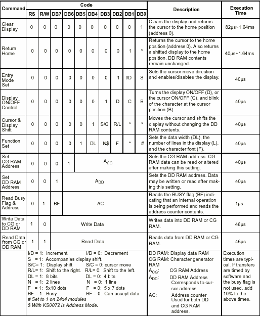
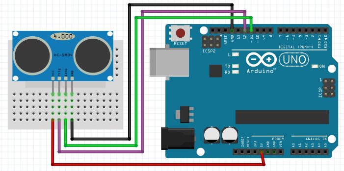

# Labo 5: Mini Project #1

## Algemene beschrijving

Voor labo 5 maken we alarmsysteem bestaand uit drukknoppen, potentiometers,
leds, een afstandssensor en LCD scherm. Het LCD gebruiken we voor het weergeven
van systeem informatie. De drukknoppen en potentiometer doen dienst als inputs.
Met de afstandssensor detecteer je beweging. 


Het LCD schermt toont de systeem informatie en voorziet een interface met de
gebruiker van het alarmsysteem. Het programma voorziet 4 menu's voor de
bediening van het alarmsysteem en de weergave van de informatie. De
verschillende menu's zijn:

1. Home scherm
2. (Dis)armed
3. Instellen paswoord
4. Afstellen van afstandssensor 

De navigatie doorheen deze menu's gebeurt met 2 drukknoppen. Met een drukknop
ga door de verschillende menu en met de andere selecteer je een menu. Eens dat
een menu geselecteerd is, kan de functionaliteit van de knop veranderen.

Het alarm systeem kan zich in één van drie verschillende fases bevinden. De
eerste is *on*, de tweede *armed* en als derde *triggered*. Tijdens de on en
armed fase toont het alarm default het home scherm. Wanneer het alarm
getriggered is toont het LCD de prompt voor het uitzetten van het alarmsysteem.

Het alarm kan op 2 manieren afgaan. De eerste manier is wanneer d.m.v. het
indrukken van een drukknop. De functionaliteit achter deze knop word behandeld
d.m.v. een interrupt. De states hebben ook een corresponderende led. Bij de
state on brand er een groene led, bij  armed een geld en bij triggered blinkt
er een rode led.


## Menu's

### Home scherm

Het home scherm toont de state (On, Armed, Triggered) van het alarm. De
functionaliteit van 2 de knoppen zijn selectie en volgende menu. Het selecteren
van dit menu heeft geen effect. Je geeft ook de laatst gemeten afstand weer en
de status van *alarm drukknop* weer wanneer het alarm armed is. Op de manier
kunnen we in een oogopslag zien welke van de 2 inputs het alarm heeft
getriggered.  

### (Dis)armed  

In dit menu kan je het alarm op en afzetten. Met een van de knoppen kan je
kiezen tussen *Armed* of *Disarmed*, met de andere bevestig je de gekozen
optie. Als je naar de Disarmed state gaat dan verwacht het systeem een
paswoord. Het paswoord geeft je in op dezelfde manier als bij het menu *Instellen paswoord*

### Instellen paswoord

Als je het paswoord menu geselecteerd is, kan je een wachtwoord selecteren met
een potentiometer en een drukknop. Met de tweede drukknop kan je de actie
annuleren. Vooraleer je het paswoord kan veranderen moet je het oude paswoord
ingeven. Het paswoord dat je kan instellen bestaat alleen maar uit nummers. Je
mag de tekens van het paswoord tonen op het scherm.

### Afstellen afstandssensor

We willen ook de gevoeligheid van de afstandssensor kunnen instellen. De
gevoeligheid is de minimale afstand die gemeten mag worden vooraleer het alarm
afgaat.  Wanneer dit menu geselecteerd is, kies je de afstand met de
potentiometer. De range gaat 1cm tot 100cm. Je bevestigd de afstand met een
drukknop. Je kan de instelling annuleren met de andere drukknop.


## Werking nieuwe componenten

### 16x2 LCD

Datasheet: [klik hier](./pdf/lcd_datasheet.pdf)

Voor deze component moet je de code voor de aansturing zelf niet schrijven. Er
is een goede library ter beschikking namelijk LiquidCrystal. Deze kan je
installeren via de Library Manager.

Meeste LCD schermen zijn derivaten van de HD44780 chip. Deze chip sturen we
aansturen met maximaal 16 pinnen.

Je sluit het LCD scherm op de volgende manier aan:


- *LED +/-*:  
  Backlight scherm

- *DB7-4*:  
  Datapinnen, je moet de LCD configureren in 4bit mode. Zenden van characters
  gebeurt in twee keer (totaal van 8 bits).

- *E*:  
  Enable signal. Als deze hoog staat, neemt de LCD de data van op de datapinnen
  op

- *R/W*:  
  Read/Write data van en naar het LCD scherm. Write is actief laag.

- *RS*: 
  Register select, low signaal selecteert het commando register, hoog signaal
  selecteert het data register

- *V0 +/-*:  
  Instellen intensiteit scherm

- *VDD*:  
  Power Supply 5V

- *VSS*:
  Power Supply voor LCM

De mogelijke commando's zijn: 




De *LiquidCrystal* library voorziet de nodige functionaliteit met een handige
interface. Voor meer informatie over deze library, zie volgende links:
 - [Arduino Reference](https://www.arduino.cc/en/Reference/LiquidCrystal)
 - [Hello World Tutorial](https://www.arduino.cc/en/Tutorial/HelloWorld)

De achterliggende code van library moet je kunnen uitleggen. Source code:
[Repository](https://github.com/arduino-libraries/LiquidCrystal).

### Ultrasone Afstandssensor

De afstandssensor werkt met ultrasone sensoren. De afstand is relatief aan
round trip tijd van het ultrasone signaail. 

Je sluit de sensor op de volgende manier aan: 



Je leest de sensor met volgend stukje code uit:

```
digitalWrite(trig_pin, LOW);
delayMicroseconds(2);
digitalWrite(trig_pin, HIGH);
delayMicroseconds(10);
digitalWrite(trig_pin, LOW);
duration = pulseIn(echo_pin, HIGH);
distance = duration*0.034/2;
```


## Opdracht:
- Maak de opdracht zoals hierboven beschreven
- Zorg ervoor dat de code overzichtelijk geschreven is.
- Hardcode zo weinig mogelijk
- De opdracht is individueel.
- Maak zeker en vast gebruik van libraries
- Upload de opdracht als een zip met als naam: *achternaam_voornaam.zip*
  (Andere inzendingen worden niet nagezien.i)


