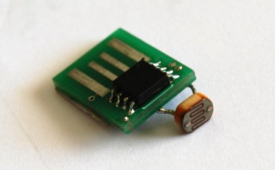
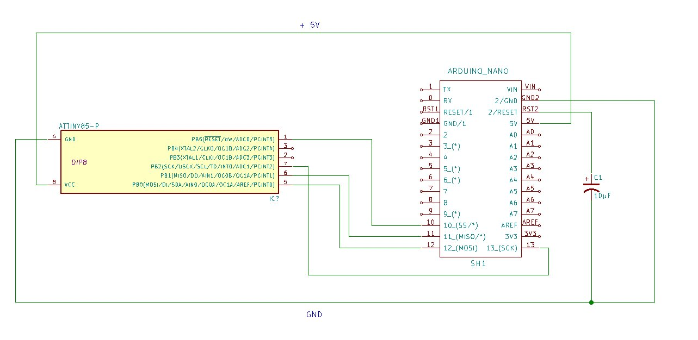

# Labo 6: Werken met de Atmel Chips

## Labo 6.1: Programmeren van een ATtiny
De ATtiny is een mini versie van de ATmega328p microcontroler. De ATtiny85 is
een chip met 8 pinnen waarvan er reeds twee nodig zijn voor de
voedingsspanning. Er zijn m.a.w. slecht 6 nuttige pinnen.  Als we ook nog ten
alle tijde willen communiceren met de chip dan blijven slechts 2 bruikbare
pinnen over..  Afhankelijk van de versie heeft hij 2 (ATtiny25), 4 (ATtiny45)
of 8Kbytes (ATtiny85) aan geheugen.  Er zijn ook nog enkele andere (grotere)
versies van de ATtiny maar die komen hier niet aan bod.

De ATtiny is natuurlijk zoals zijn naam doet vermoeden vrij klein. Ook al is
hij beperkt qua aansluitingen in veel schakelingen hebben we eingelijk niet
meer nodig dan dat en is hij dus ideaal geschikt.

Om met de Arduino-IDE sketches te kunnen uploaden naar deze microcontroler
moet deze laatste hiervoor reeds een stukje software bevatten. Dit stukje
software noemen we de *bootloader*.

Om zo'n bootloader op onze microcontroler-chip te branden hebben we nu wel wat
extra hardware nodig.  Deze hardware noemen we een 'ISP' op
'In-System-Programmer'. Vaak spreken we ook gewoon simpelweg van een
'programmer'.  Dit laatste is eigenlijk een groepsnaam want ook heel wat andere
soorten micro chips zoals cpld's, fpga's, eeprom's worden ook met hun versie
van zo'n 'programmer' van code of data voorzien.

Om ons wat geld te besparen hebben het ontwikkel-team van Arduino gelukkig een
stukje software geschreven waardoor we een bestaande Arduino hardware ook als
programmer kunnen gebruiken voor een nieuwe chip!

### Toevoegen ATTiny aan de Arduino-IDE

Het  eerste probleem is dat we nu moeten oplossing is dat ATtiny niet voorkomt
in de lijst van beschikbare boards/chips in de IDE.  Gelukkig heeft iemand van
MIT reeds een library gemaakt voor onze IDE te vinden op github.  [ATtiny Board
Library](https://github.com/damellis/attiny) - door David Mellis Ph.D. MIT
Media Lab.

Deze library toevoegen aan de IDE doen we als volgt: ga naar `File` en dan
`Preferences`.  Er opent een venster met diverse instellingen en onderaan zien
we `Additional Boards Manager URLs`

Copy en Paste daar nu de volgende URL:
[https://raw.githubusercontent.com/damellis/attiny/ide-1.6.x-boards-manager/package_damellis_attiny_index.json](
https://raw.githubusercontent.com/damellis/attiny/ide-1.6.x-boards-manager/package_damellis_attiny_index.json)
klik vervolgens op `Ok`

Hierna gaan we naar `Tools` dan `Board:` en we kiezen bovenaan `Board Manager`
Als we door de lijst scrollen komen we ergens de volgende tekst tegen:

Bij het klikken op de tekst verschijnt net zoals in de afbeelding hierboven ook
rechts een knop `Install` Na het drukken op install is de IDE even bezig met
installeren en krijgen we terug ons vertrouwde scherm.

### De Arduino Nano als Programmer
Om de Arduino Nano als programmer te gebruiken moeten we deze eerst laden met
de `ArduinoISP` sketch. Je sluit daartoe de Arduino Nano aan op een leeg
breadbordje, dus met geen enkele pin van de Nano verbonden!

Kies vervolgens in het `File` menu van de Arduino-IDE uit de lijst `Examples`
de sktech `ArduinoISP` Je zorgt dat bij `tools` zeker het bord `Arduino Nano`
geselecteert staat en vervolgens upload je de code naar de Nano

Als dit klaar is hebben we onze Nano omgetovert in een micro-controller
programmer voor Atmel chips. We zorgen er vervolgens voor dat hij zeker niet
langer spanning krijgt door de usb kabel los te koppelen.

### Branden van de bootloader 
Nu het branden van een bootloader zelf.Om dit te doen moeten we de ATtiny
aansluiten aan een programmer. In dit geval een Arduino Nano. Maak hiervoor de
onderstaande afbeelding.  

Als we alles juist aangesloten hebben kunnen we terug effectief overgaan tot
het branden zelf.  We pluggen nu de usb kabel van onze laptop terug in onze
Arduino Nano `programmer`

Vervolgens kiezen we in de Arduino IDE bij `tools` en als `programmer:`
 `Arduino as ISP`

Belangrijke volgende stap is om onder `tools` vervolgens `board` ditmaal
`ATtiny25/26/85` te kiezen, maar ook bij `processor` niet vergeten om
`ATtiny85` te selecteren! Herinner dat bij het branden van de bootloader hier
altijd de selectie gekozen worden van de chip en bord dat we willen branden,
niet waarmee we branden

Na voorgaande puntjes nog even te checken kiezen we onder `tools` ten slotte
het item `Burn Bootloader`.  Zodra je dit doet zie je opnieuw de tx en rx led`s
op de Nano knipperen en even later is het van de Tiny branden klaar.

## Labo 6.2: Werken met de ATtiny registers

### Toch eerst nog even testen
Vooralleer we met registers gaan werken op de tiny kunnen we ons best nog even
vergewissen dat de bootloader goed werkt Bouw daarom nu eerst een 'blink'
schakeling en schrijf de bijbehorende sketch.  Het uploaden van onze sketch
doen we opnieuw via de Arduino Nano en de IDE dankzij de 'shift' op ons
keyboard

Aan welke pin je de LED (MET WEERSTAND!!!!) moet hangen zoek je uit op de
datasheet van de chip:

[Datasheet](http://www.atmel.com/Images/Atmel-2586-AVR-8-bit-Microcontroller-ATtiny25-ATtiny45-ATtiny85_Datasheet.pdf)

LED's rechtreeks via de registers
De bedoeling van deze opdracht is dat je twee LED's kan aanzetten met een schakelaar. Je doet dit met een sequentie.
Eerste led aan, dan tweede led aan (een blijft branden) dan eerste led uit, en ten slotte tweede led uit.

Je zet best de led's op de 2 vrije pinnen van de ATtiny. De schakelaar moet dan een pin delen met een
van de spi communicatie lijnen. Je moet dus telkens die lijn loskoppelen en wisselen tussen de schakelaar en de Nano
om te programmeren...

Je zoekt zelf uit hoe je dit alles doet, welke bitoperaties je nodig hebt, hoe je de registers moet configureren, etc..

Als je klaar bent met deze oefening laad dan je code op in digitap op de daartoe voorziene plaats

 
